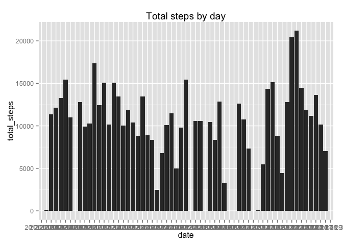
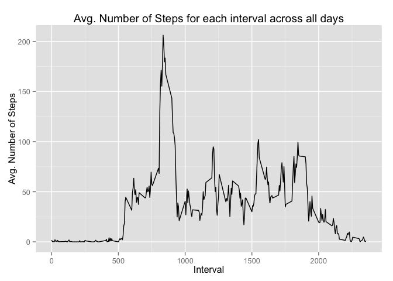
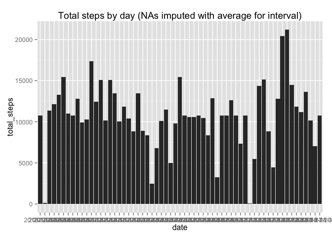
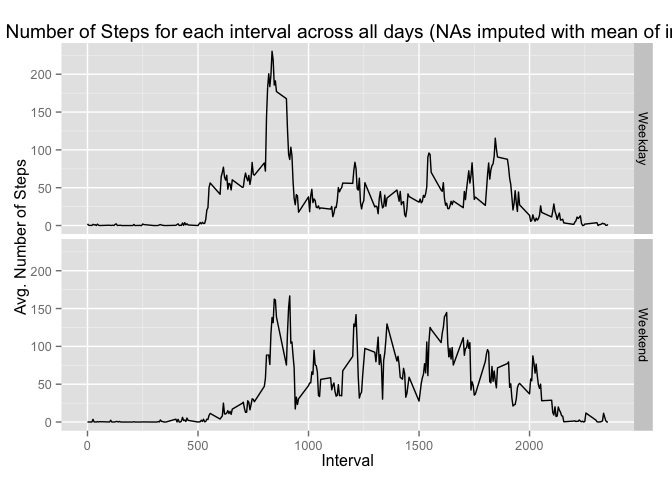

# Reproducible Research: Peer Assessment 1


## Loading and preprocessing the data
First, load the data:

```r
activity <- read.csv("activity.csv")
```

## What is mean total number of steps taken per day?
For this analysis, we'll be using ggplot2.

1. First, summarise the data, calculating the sum of all steps per day, and plot a histogram of the number of steps per day

```r
library(ggplot2)
library(dplyr)
```

```
## 
## Attaching package: 'dplyr'
## 
## The following objects are masked from 'package:stats':
## 
##     filter, lag
## 
## The following objects are masked from 'package:base':
## 
##     intersect, setdiff, setequal, union
```

```r
sum_by_date <- group_by(activity,date) %>% summarise(total_steps = sum(steps))

qplot(date, data = sum_by_date, geom = "bar", weight = total_steps, ylab = "total_steps",main = "Total steps by day")
```

 

2. Next, calculate the mean and median total steps per day

```r
round(mean(sum_by_date$total_steps,na.rm = TRUE),digits = 2)
```

```
## [1] 10766.19
```

```r
median(sum_by_date$total_steps,na.rm = TRUE)
```

```
## [1] 10765
```


## What is the average daily activity pattern?

1. First summarise the data, calculating the average # of steps for each interval (removing NA values), and plot the results

```r
avg_by_int <- group_by(activity,interval) %>% summarise(avg_steps = mean(steps,na.rm = TRUE))

qplot(avg_by_int$interval,avg_by_int$avg_steps, geom = "line", xlab = "Interval",ylab = "Avg. Number of Steps", main = "Avg. Number of Steps for each interval across all days")
```

 

2. Order the data frame by average number of steps and return the first interval value


```r
ordered <- arrange(avg_by_int,desc(avg_steps))
max_interval <- ordered$interval[1]
```

The 5 minute interval with the highest average number of steps is interval number 835

## Imputing missing values
1. Count the number of NA values in the data set

```r
na_test <- mutate(activity,is_na = is.na(steps))
num_na <- sum(na_test$is_na)
```
There are 2304 NA values in the data set.

2. To deal with missing values, we will replace them all with a value calculated from the average value of that interval across all days that contain a value.

3. This will require the use of the mutate and replace functions 
NOTE: Warnings in the following code are hidden


```r
impute_activity <- group_by(activity,interval) %>% mutate(interval_avg = mean(steps,na.rm = TRUE),is_na = is.na(steps))
impute_activity <- mutate(impute_activity,impute = replace(steps,is_na,interval_avg))
```

4. First we calculate the sum of steps on all days using imputed data and plot them in a histogram


```r
impute_sum_by_date <- group_by(impute_activity,date) %>% summarise(total_steps = sum(impute))

qplot(date, data = impute_sum_by_date, geom = "bar", weight = total_steps, ylab = "total_steps",main = "Total steps by day (NAs imputed with average for interval)")
```

 

Compared to the non-imputed data from question 1,


```r
sum_by_date <- group_by(activity,date) %>% summarise(total_steps = sum(steps))

qplot(date, data = sum_by_date, geom = "bar", weight = total_steps, ylab = "total_steps",main = "Total steps by day")
```

 

there are not too many differences. The main difference is that entire days that were missing are replaced with an "average" day (one, consisting of the sum of the average of each interval).

The mean and median do not change much.


```r
round(mean(impute_sum_by_date$total_steps),digits = 2)
```

```
## [1] 10766.19
```

```r
round(median(impute_sum_by_date$total_steps),digits = 2)
```

```
## [1] 10766.19
```

Unsurprisingly, the mean of the imputed values is exactly the same as the mean of the missing NA values. The median of the imputed values  is about 1.19 steps off the median missing NA values.

The only impact of imputing missing data on estimates for total daily number of steps is the addition of several days worth of data. While this does not affect the mean or median greatly, it does assume that steps were taken on these days. 

The values could be missing because the device was off or because it was not worn. This information would be useful to determine whether to impute mean values or 0 values.

## Are there differences in activity patterns between weekdays and weekends?

1. First we want to categorize each day as a weekday or weekend


```r
impute_activity <- mutate(impute_activity,weekday = weekdays(as.Date(date)))
impute_activity <- mutate(impute_activity,day = ifelse(weekday %in% c("Saturday","Sunday"),"Weekend","Weekday"))
```

2. Now using this new factor, we'll plot the the average steps taken for each interval, using the imputed data and the Weekday/Weekend factor


```r
impute_avg_by_int <- group_by(impute_activity,interval,day) %>% summarise(avg_steps = mean(impute))

qplot(interval,avg_steps, data = impute_avg_by_int, geom = "line", facets = day ~ ., xlab = "Interval",ylab = "Avg. Number of Steps", main = "Avg. Number of Steps for each interval across all days (NAs imputed with mean of interval)")
```

 

Interestingly, there is a similar amount of activity in the morning one both the weekday and weekend, but there is continued activity throughout the day on the weekend.
